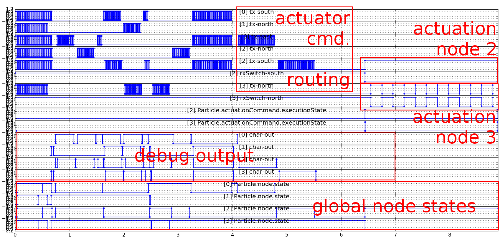

Particle Network Visualization
===============================
Visualization tool for plotting communication/wire/LED signals, interrupts, global variable values and much more.

Usage
-----
python Network1x2-Node0-to-1-CommunicationPlot.py
python Network1x3-NodeM-to-N-CommunicationPlot.py
python Network2x2-NodeM-to-N-CommunicationPlot.py
python Network3x1-NodeM-to-N-CommunicationPlot.py
python Network3x3-NodeM-to-N-CommunicationPlot.py

Depending on log file size the program may take several seconds to plot.

Configuration
-------------
Input adjustments can be configured in 
    
    Input.py
    
Value mappings may be adjusted in 

    Mappings.py

Screenshots
-----------

### 3x3 network simulation - communication/states
Example of
1. enumeration phase followed by
1. network geometry discovery and
1. time synchronization.

### 3x3 network simulation - communication/states
Example of network initialization followed by
1. a heat command routing to node 3 and
1. actuator command execution of node 2 and 3.

    
